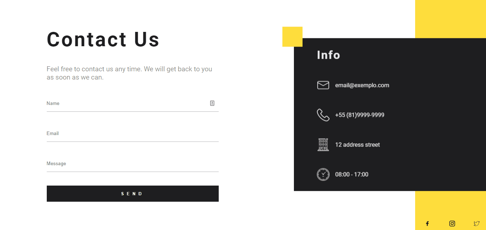
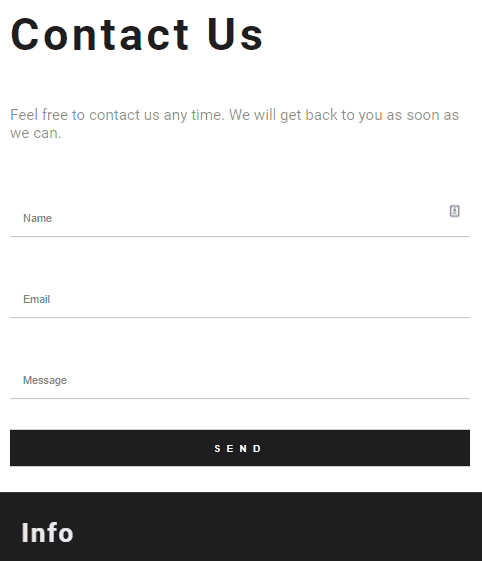

<div align="center">
	<h1>landing page</h1>
</div>

## :camera: Demonstração



<p align="center">
	
</p>

## :dart: Objetivo

Essa aplicação é uma página de contato, as animações foram feitas usando a biblioteca Animate e a estilização com o SASS. A aplicação está integrada com o Gmail usando a biblioteca Nodemailer. Quando os campos são preenchidos e a mensagem enviada, será recebida no e-mail cadastrado no ponto 3 de Executando os projeto.
Projeto ainda está em construção.

## :hammer_and_wrench: Ferramentas

- [Node](https://nodejs.org/)
- [Nodemailer](https://nodemailer.com/)
- [Animate](https://animate.style/)
- [Express](https://expressjs.com/)
- [Yarn](https://yarnpkg.com/)

## :rocket: Executando o projeto

1.Clonando o repositório

```bash
git clone https://github.com/Felipefmv/dtmoney
```

2.Para instalar rode

```
yarn
```

3.Concluindo a instalação crie essas variáveis de anbiente num arquivo .env

```
HOST = smtp.gmail.com
PORT = 587
USER = //e-mail do gmail
PASS = //senha do e-mail
```

4.Rode

```
yarn start
```

5.Acesse http://localhost:3000/
